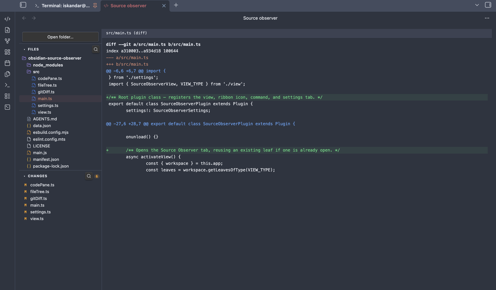

# Source Observer

A lightweight codebase viewer for [Obsidian](https://obsidian.md). Browse any folder on disk, read files with syntax highlighting, and review git changes — without leaving your vault.



## Features

- **File tree** — open any folder, navigate directories, see file-type icons with language colours
- **Syntax highlighting** — reads your active Obsidian theme; supports JS/TS, Python, Rust, CSS, HTML, JSON, Markdown and more
- **Git diff** — changed files listed in the sidebar with M/A/D badges and new/modified counts; click any file to see its diff or full content
- **Collapsible sections** — Files and Changes panels collapse independently
- **Search** — filter files or changed files by name via the search icon in each section header

## Usage

1. Click the `</>` icon in the ribbon or run **Open Source Observer** from the command palette
2. Click **Open folder…** to select any directory on your machine
3. Browse files in the **Files** panel — click to open with syntax highlighting
4. Switch to the **Changes** panel to see modified, added, and deleted files relative to git HEAD; click any file to view its diff
5. Use the search icon in each section header to filter by filename

## Installation

1. Copy `main.js`, `styles.css`, and `manifest.json` into `<vault>/.obsidian/plugins/obsidian-source-observer/`
2. Enable the plugin in **Settings → Community plugins**
3. Click the `</>` icon in the ribbon or run **Open Source Observer** from the command palette

## Development

```bash
npm install
npm run dev    # watch mode
npm run build  # production build
```

## License

MIT
