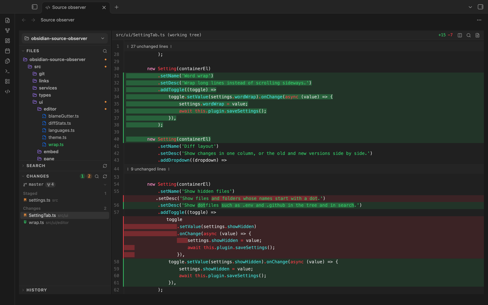

# Source Observer

An Obsidian plugin for browsing local code: open any folder, read files with syntax highlighting, and review git changes. Read-only and offline.



## Features

- File tree with git status, syntax highlighting, find in file and go to line
- Changes grouped into conflicts, staged and unstaged, with unified or side-by-side diffs
- Search in files (`git grep` in repositories)
- File history and blame
- Worktree switcher: select the branch name in **Changes**
- Links and live embeds of code in notes

## Usage

Run **Source Observer: Open**, then select **Open folder…** at the top of the sidebar. All actions are also available as commands under **Source Observer:** in the command palette. In the viewer, <kbd>Mod</kbd>+<kbd>F</kbd> finds in the open file and <kbd>Mod</kbd>+<kbd>Shift</kbd>+<kbd>F</kbd> searches all files.

To reference code from a note, select lines and use the link icon in the viewer header: **Copy link**, **Copy embed** or **Copy as code block**. An embed looks like this:

````markdown
```source-observer
folder: /Users/me/code/my-project
file: src/server.ts
lines: 40-75
```
````

`file` can be relative to `folder` or absolute. `lines` is optional. Links and embeds use absolute paths, so they only work on the computer that made them.

## Installation

Install from **Settings → Community plugins → Browse**, or copy `main.js`, `manifest.json` and `styles.css` from the [latest release](https://github.com/IceKhan13/obsidian-source-observer/releases/latest) to `<vault>/.obsidian/plugins/source-observer/`.

Requires desktop Obsidian 1.7.2+. Git features need `git` on your `PATH`.

## Privacy

Source Observer makes no network requests. It only runs read-only git commands (`status`, `ls-files`, `cat-file`, `grep`, `log`, `blame`, `worktree list`) with `--no-optional-locks`, so it never writes to your repository.

## Development

See [CONTRIBUTING.md](CONTRIBUTING.md).

## License

MIT
