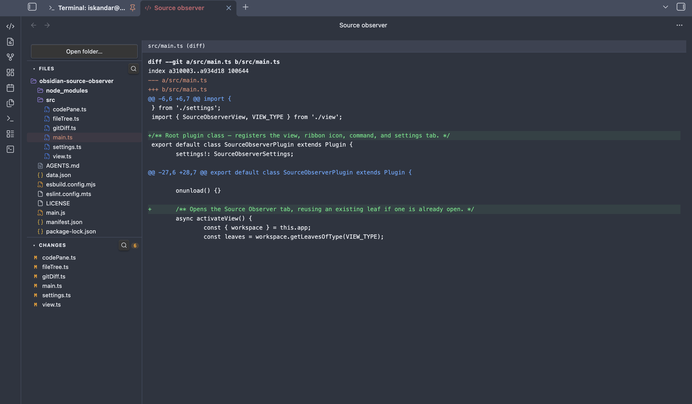

# Source Observer

A lightweight codebase viewer for [Obsidian](https://obsidian.md). Browse any folder on disk, read files with syntax highlighting, and review git changes — without leaving your vault.



## Features

- **File tree** — navigate any folder with file-type icons; files and folders are coloured by git status, and folders containing changes are marked with a dot. The tree updates itself when files are created or deleted.
- **Syntax highlighting** — follows your Obsidian theme. Supports JS/TS, Python, Rust, Go, Ruby, Java, Kotlin, Scala, C/C++, C#, Swift, PHP, Lua, SQL, shell, CSS, HTML, Vue/Svelte, JSON, YAML, TOML, Markdown, Dockerfiles and more.
- **Git changes** — changed files grouped into **Merge conflicts**, **Staged** and **Changes**, with the current branch and ahead/behind counts.
- **Inline diffs** — a syntax-highlighted unified diff with unchanged regions collapsed and `+added −removed` line counts. Staged diffs compare HEAD to the index; unstaged diffs compare the index to the working tree.
- **Live updates** — the change list, tree and open file refresh automatically when files or git state change.
- **Subfolders of a repository** — open any folder inside a repo; only changes within that folder are shown.
- **Search** — file-name search with exact and prefix matches ranked first (respects `.gitignore` in repositories; type a `/` to match paths) and a filter for changed files.
- **Keyboard navigation** — arrow keys, Home/End, Enter, and Left/Right to collapse and expand folders.
- **Recent folders** and a resizable sidebar.
- **Safe with large and binary files** — files over 2 MB and binary files show a message instead of being loaded.

## Usage

1. Select the `</>` icon in the ribbon or run **Source Observer: Open** from the command palette.
2. Select the folder button at the top of the sidebar, then **Browse…**, **Enter path…**, or a recent folder. You can also run **Source Observer: Open folder…**.
3. Select a file in **Files** to view it, or a file in **Changes** to view its diff. In a diff, use the file icon in the header to open the full file.
4. Use the search icon in each section header to filter; press <kbd>Esc</kbd> to close the search.
5. Drag the border between the sidebar and the viewer to resize it; double-click to reset.

## Privacy

Source Observer works entirely offline. It reads files from the folder you open and runs your local `git` executable (read-only commands such as `status`, `ls-files` and `cat-file`, with `--no-optional-locks` so it never writes to your repository). It makes no network requests and collects no data.

## Installation

1. Copy `main.js`, `styles.css`, and `manifest.json` into `<vault>/.obsidian/plugins/source-observer/`.
2. Enable the plugin in **Settings → Community plugins**.

The plugin is desktop-only because it reads the file system and runs `git`.

## Development

```bash
npm install
npm run dev    # watch mode
npm run build  # type-check and production build
npm run lint
npm test       # unit, git integration and DOM tests (vitest)
```

### Architecture

```
src/
  main.ts                     plugin lifecycle, commands
  settings.ts                 settings model, defaults, validation
  git/
    GitRepo.ts                resolves root/git dir/prefix; runs git with --no-optional-locks
    status.ts                 pure parser for `git status --porcelain=v2`
    diffSources.ts            loads the two sides of a diff
  services/
    RepoState.ts              single-flight status refresh with stale-result protection
    RepoWatcher.ts            watches the git dir and working tree; polls only while visible
    FileIndex.ts              cached file list for search (git ls-files or a bounded walk)
  ui/
    SourceObserverView.ts     layout and wiring
    sidebar/                  Files and Changes sections, tree, keyboard navigation
    pane/                     content pane and its renderers (code, diff, message)
    editor/                   CodeMirror theme, languages, diff stats
  utils/                      file reading, icons, paths, request tokens
```

Each renderer in the content pane is an Obsidian `Component`, so swapping what is shown always tears down the previous editor, DOM and listeners. All loads into the pane go through one "latest request wins" token, so a slow load can never replace a newer selection.

## License

MIT
