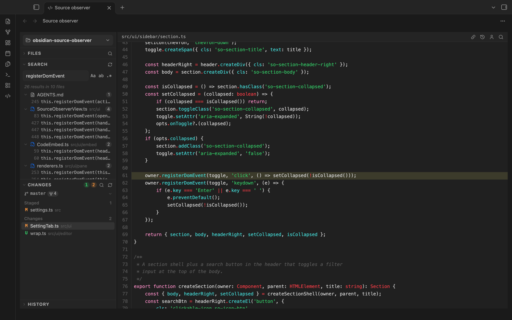
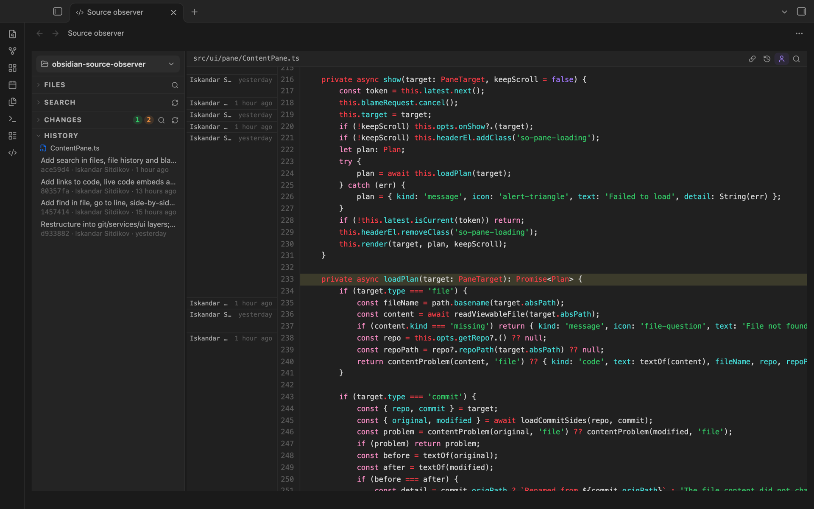
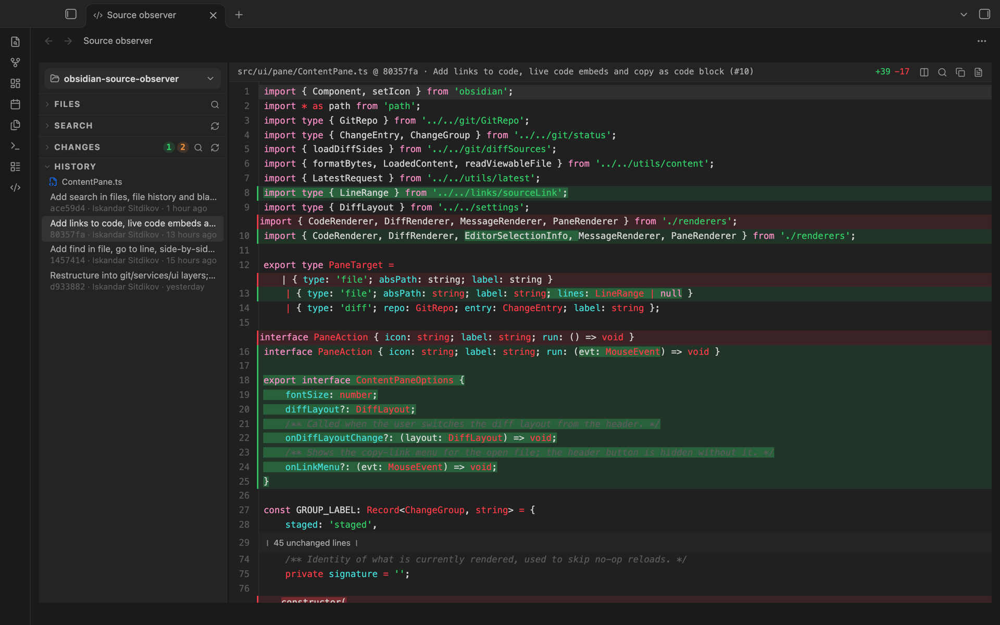
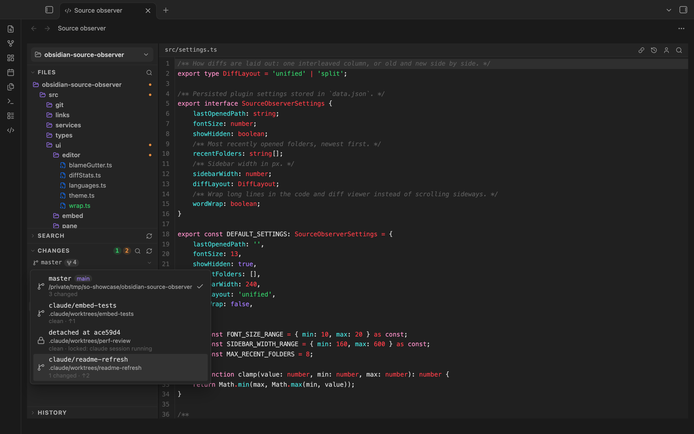
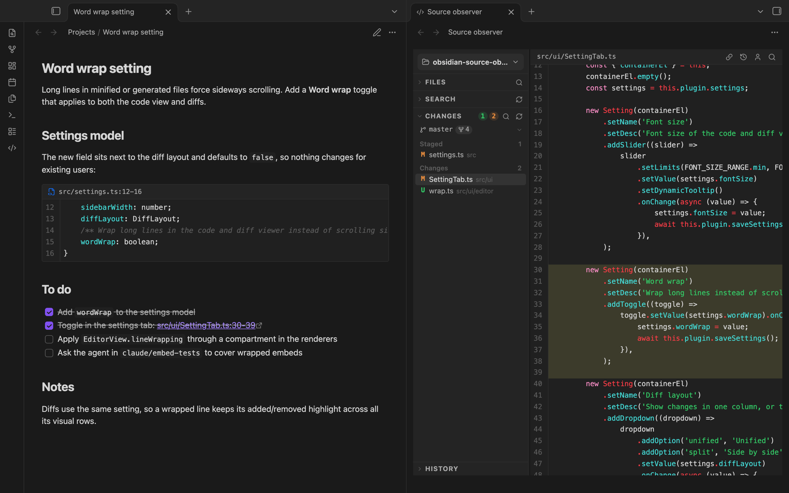

# Source Observer

[](https://github.com/IceKhan13/obsidian-source-observer/actions/workflows/lint.yml)
[](https://github.com/IceKhan13/obsidian-source-observer/releases/latest)
[](LICENSE)

**A read-only code viewer and git reviewer inside [Obsidian](https://obsidian.md).** Open any folder on your computer, read code with syntax highlighting, review changes, search, follow history — and link or embed live code in your notes.

It is built for two kinds of work:

- **Thinking about code in your notes** — design docs, code-reading notes and dev journals that link to and embed the real source, instead of pasted snippets that go stale.
- **Keeping an eye on changes** — your own uncommitted work, or what coding agents are doing in parallel worktrees, without switching to an IDE.

Source Observer never modifies your code or your repository, makes no network requests, and works entirely offline.


## Highlights

### Browse and read

- A file tree for any folder, with file-type icons and git status colours; folders that contain changes are marked with a dot.
- Syntax highlighting that follows your Obsidian theme, for JS/TS, Python, Rust, Go, Ruby, Java, Kotlin, Scala, C/C++, C#, Swift, PHP, Lua, SQL, shell, CSS, HTML, Vue, Svelte, JSON, YAML, TOML, Markdown, Dockerfiles and more.
- **Find in file** with case, whole-word and regular-expression options, and **Go to line** (`42`, `42:7`, `+10` or `50%`).
- Open a whole repository or any folder inside one; only that folder's files and changes are shown.
- Everything refreshes by itself when files or git state change.

### Review changes

- Changed files grouped into **Merge conflicts**, **Staged** and **Changes**, with the current branch and how far it is ahead of or behind its upstream.
- Syntax-highlighted diffs, unified or side by side, with unchanged regions collapsed and `+added −removed` counts. Staged diffs compare `HEAD` with the index; unstaged diffs compare the index with your files.

### Search

- **Search in files** across the whole folder, with **Match case**, **Match whole word** and **Use regular expression**. Results are grouped by file with the matches highlighted; select one to open the file at that line. In a repository it uses `git grep`, so `.gitignore` is respected and binary files are skipped.
- Quick file-name search in **Files** (type a `/` to match paths), and a filter for **Changes**.



### History and blame

- **History** lists the commits that changed the open file, newest first and following renames. Select a commit to see exactly what it changed in that file.
- **Blame** shows who last changed each line, and when, in a gutter beside the code. Select an entry to open that commit's change.





### Worktrees for parallel work

Select the branch name at the top of **Changes** to list every worktree of the repository — handy when several coding agents or branches are in flight at once. Each entry shows its branch, where it lives, how many files it has changed, how far it is ahead or behind, and whether it is locked or missing. Choose one to open it in place: the same subfolder and the same file stay open, so comparing versions takes one click.



### Code in your notes

- **Copy link** — a link to a file or the selected lines. Opening it jumps to that spot in Source Observer, with the lines highlighted.
- **Copy embed** — a live excerpt that keeps its real line numbers and updates when the file changes.
- **Copy as code block** — a static, fenced copy of the selection, followed by a link back to the source.



## Quick start

1. Install **Source Observer** from **Settings → Community plugins → Browse** and enable it.
2. Select the `</>` icon in the ribbon, or run **Source Observer: Open** from the command palette.
3. Select **Open folder…** at the top of the sidebar, then **Browse…** or **Enter path…** to choose a folder or git repository on your computer.

Select a file in **Files** to read it, or a file in **Changes** to see its diff.

## Using Source Observer

### The sidebar

| Section | What it shows |
| --- | --- |
| **Files** | The folder as a tree. Use the search icon to find files by name. |
| **Search** | Search inside files. Collapsed until you need it. |
| **Changes** | Conflicts, staged and unstaged changes, the current branch and the worktree switcher. |
| **History** | Commits that changed the open file. Collapsed until you need it; it follows whichever file is open. |

Drag the border between the sidebar and the viewer to resize it; double-click it to reset. Lists support the arrow keys, <kbd>Home</kbd>, <kbd>End</kbd> and <kbd>Enter</kbd>; in trees, <kbd>←</kbd> and <kbd>→</kbd> collapse and expand folders.

### The viewer header

The icons above a file or diff depend on what is shown:

- **Copy link** — copy a link, an embed or a code block for the file or the selected lines.
- **Show file history** and **Toggle blame** — for files in a git repository.
- **Show side by side** or **Show unified** — switch the diff layout.
- **Copy commit hash** — when a commit from **History** is shown.
- **Open file** — open the whole file from a diff.
- **Find in file**.

Right-click a file, folder or change for **Copy path**, **Copy relative path**, **Reveal in Finder** (**Show in system explorer** on Windows and Linux), **Open in default app**, **Copy link** and **Copy embed**.

### Commands and shortcuts

| Command | Shortcut |
| --- | --- |
| **Source Observer: Open** | |
| **Source Observer: Open folder…** | |
| **Source Observer: Search in files** | <kbd>Mod</kbd>+<kbd>Shift</kbd>+<kbd>F</kbd> in the viewer |
| **Source Observer: Find in file** | <kbd>Mod</kbd>+<kbd>F</kbd> in the viewer |
| **Source Observer: Go to line** | |
| **Source Observer: Show file history** | |
| **Source Observer: Toggle blame** | |
| **Source Observer: Switch worktree…** | |
| **Source Observer: Copy link to file or selection** | |
| **Source Observer: Copy embed of file or selection** | |
| **Source Observer: Copy file or selection as code block** | |

Assign your own shortcuts in **Settings → Hotkeys**. <kbd>Mod</kbd> is <kbd>Cmd</kbd> on macOS and <kbd>Ctrl</kbd> on Windows and Linux.

### Links and embeds

To reference code, select lines in a file (or select nothing for the whole file), select the link icon in the header, and choose **Copy link**, **Copy embed** or **Copy as code block**. Then paste into any note.

An embed is a code block with the `source-observer` language:

````markdown
```source-observer
folder: /Users/me/code/my-project
file: src/server.ts
lines: 40-75
```
````

- `file` is required. It is relative to `folder`, or an absolute path (a leading `~` means your home folder), in which case `folder` can be left out.
- `lines` is optional: a single line (`12`) or a range (`40-75`). Without it, the whole file is embedded.
- Select the header of an embed to open the file in Source Observer at those lines.

A link looks like `obsidian://source-observer?folder=…&file=…&lines=…` and works anywhere Obsidian opens links.

## Settings

In **Settings → Source Observer**:

| Setting | Description | Default |
| --- | --- | --- |
| **Font size** | Size of code and diff text, from 10 to 20 pixels. | 13 |
| **Diff layout** | **Unified** or **Side by side**. You can also switch from the diff header. | Unified |
| **Show hidden files** | Show files and folders whose names start with a dot, in the tree and in search. | On |
| **Recent folders** | Select **Clear** to forget the folders listed under **Open folder…**. | |

## Requirements

- Obsidian 1.7.2 or later on desktop: macOS, Windows or Linux. Source Observer reads files from disk and runs `git`, so it is not available on mobile.
- [Git](https://git-scm.com/) on your `PATH` for changes, diffs, history, blame and worktrees. Without git you can still browse, read and search any folder.

## Installation

**From Obsidian** (recommended): open **Settings → Community plugins → Browse**, search for **Source Observer**, then select **Install** and **Enable**.

**Manually**: download `main.js`, `manifest.json` and `styles.css` from the [latest release](https://github.com/IceKhan13/obsidian-source-observer/releases/latest) into `<vault>/.obsidian/plugins/source-observer/`, then enable the plugin in **Settings → Community plugins**.

## Privacy and safety

- **Offline.** Source Observer makes no network requests and collects no data.
- **Read-only.** It reads files from the folder you open and runs your local `git` with read-only commands only — `status`, `ls-files`, `cat-file`, `grep`, `log`, `blame` and `worktree list` — with `--no-optional-locks`, so it never writes to your repository, not even to git's index.
- **Explicit hand-offs.** **Reveal in Finder** and **Open in default app** pass the selected path to your operating system. Embeds read the files they name, and opening an `obsidian://source-observer` link opens that folder in the viewer.

## Limits and known issues

- **Links and embeds use absolute paths**, so they work on the computer they were made on. On another computer they show "file not found" unless the code is at the same path there.
- Files over **2 MB** and binary files show a message instead of their contents.
- **Search in files** stops after **2,000** matching lines, and file-name search indexes up to **50,000** files. **History** lists the latest **300** commits of a file.
- While the viewer is focused, <kbd>Mod</kbd>+<kbd>Shift</kbd>+<kbd>F</kbd> searches the open folder instead of opening Obsidian's vault search.
- If your worktrees live inside the repository (for example in `.claude/worktrees/`), add that folder to `.gitignore` or `.git/info/exclude`. Otherwise git reports them as untracked folders in the main worktree.

Found a bug or have an idea? [Open an issue](https://github.com/IceKhan13/obsidian-source-observer/issues).

## Contributing

Contributions are welcome. See [CONTRIBUTING.md](CONTRIBUTING.md) for setting up a development vault, running the tests, and an overview of the architecture.

## License

[MIT](LICENSE)
